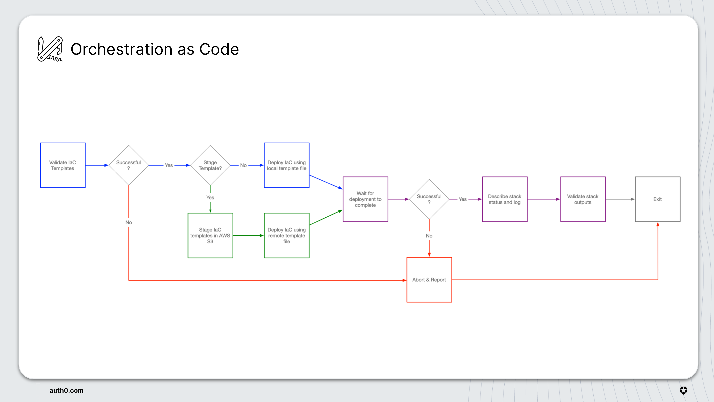
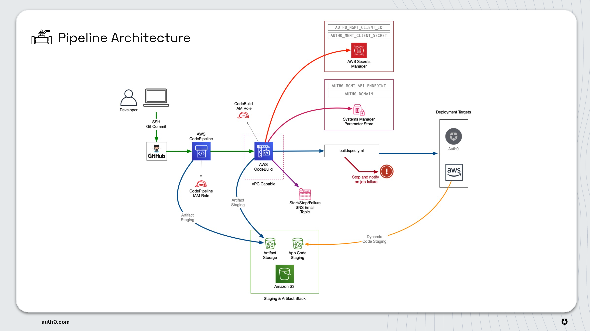

# Flycatcher Pipeline

This repository contains Infrastructure as Code (IaC) that will deploy a CI/CD pipeline in AWS that is configured to listen for code commits to a Github repository.  These are the basic building blocks that readers should review:

|  |  |
| --- | --- |
| Configuration as Code | [configure.py](configure.py) is a utility that reads parameters in from [config/pipline.conf](config/pipeline.conf) and distributes those parameters throughout the code base.  The purpose of this utility is to keep custom parameters in a centralized location (to the greatest extent possible). |
| Orchestration as Code | [deploy.sh](deploy.sh) is a deployment orchestration utility that reads parameters in from [env/aws/pipeline_env.sh](env/aws/pipeline_env.sh) and orchestrates the deployment of the pipeline.  (env/aws/pipeline_env.sh is configured by the configuration utility) |
| Infrastructure as Code | [infra/aws/pipeline/pipeline.json](infra/aws/pipeline/pipeline.json) is the Cloudformation file that defines the pipeline infrastructure. |

## Workflow

|  |  |
| --- | --- |
| Clone the pipeline source code | `git clone git@github.com:mcooper-cloud/flycatcher_pipeline.git pipeline` |
| Modify the config file | `cd pipeline && vi config/pipeline.conf` |
|(if necessary) install the Jinja2 python libraries using the requirements.txt file| `pip3 install -r requirements.txt` |
| Run configuration as code |  `./configure.py --config config/pipeline.conf` |
| Run orchestration as code | `./deploy.sh --env-file env/aws/pipeline_env.sh` |
| Configure the Codestar connection | [Configure Codestar](https://docs.aws.amazon.com/dtconsole/latest/userguide/connections-update.html) |